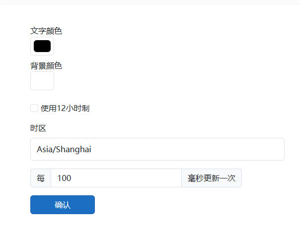
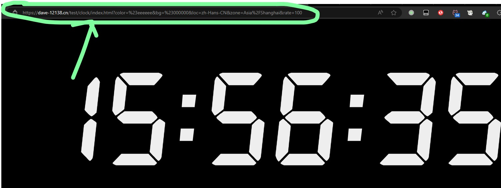
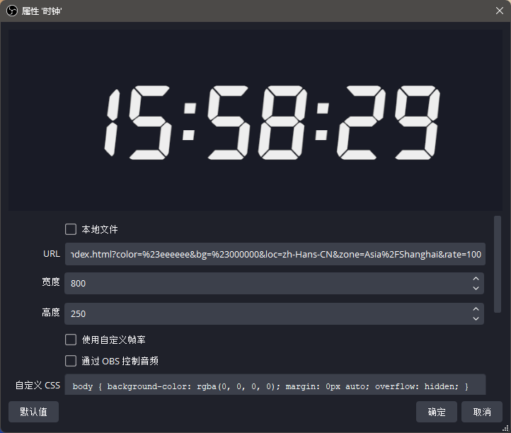

# OBS-Clock
一个在OBS内显示当前时间的应用。An application for displaying the current time within the OBS

使用教程：

1. 下载本仓库的master分支并解压，或访问[在线版本](https://dave-12138.cn/test/clockOption.html)
2. 打开<code>clockOption.html</code>，你会看到一个设置界面

3. 根据你的需要调整设置并点击确认，浏览器会跳转到时钟页面

4. 你需要复制该页面的地址
5. 打开OBS，在场景内添加一个“浏览器”源，将刚复制的链接粘贴到<code>URL</code>栏

6. 点击确定即可使用
